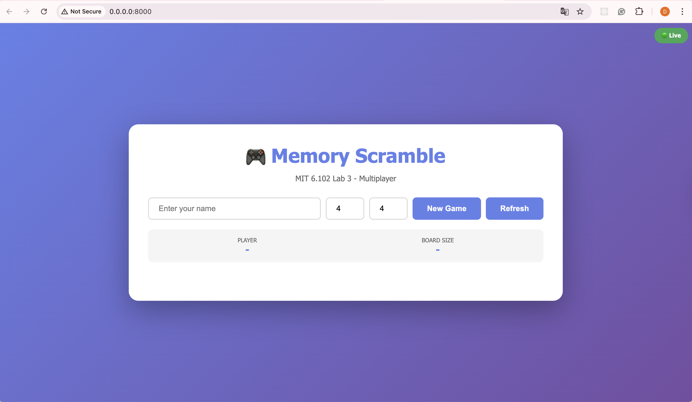
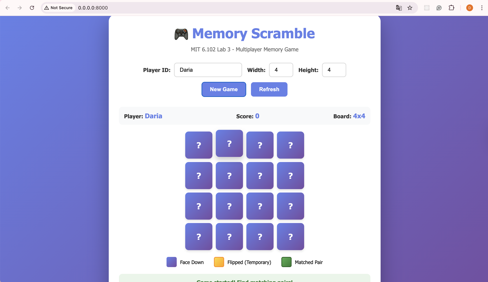
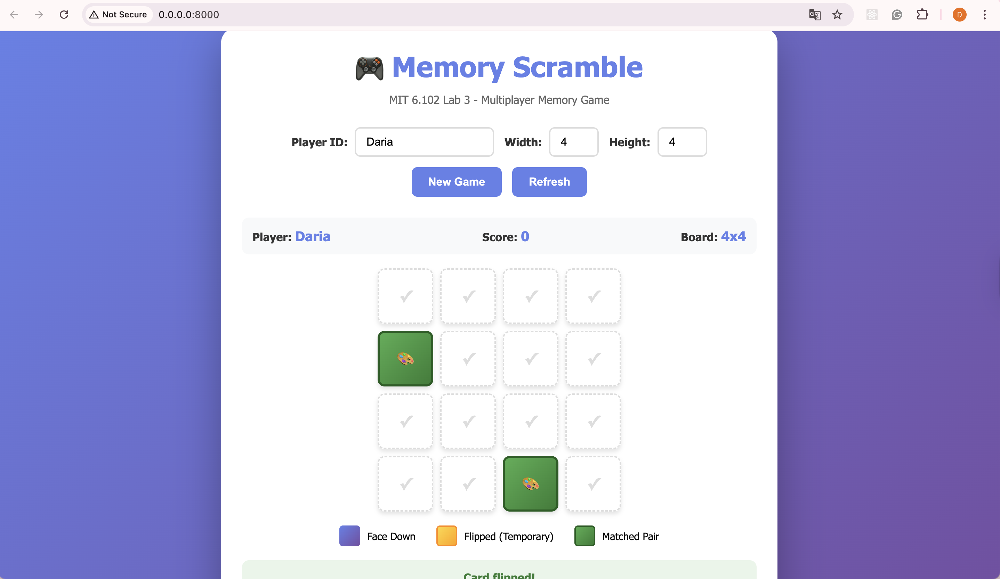
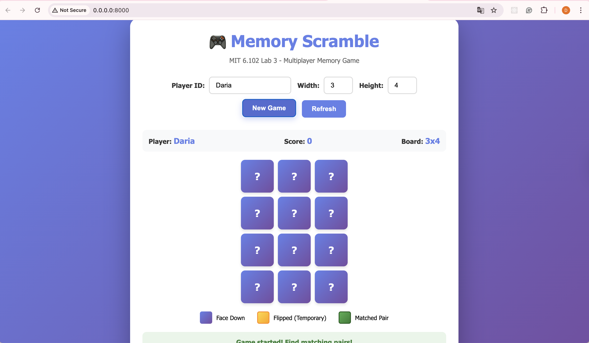
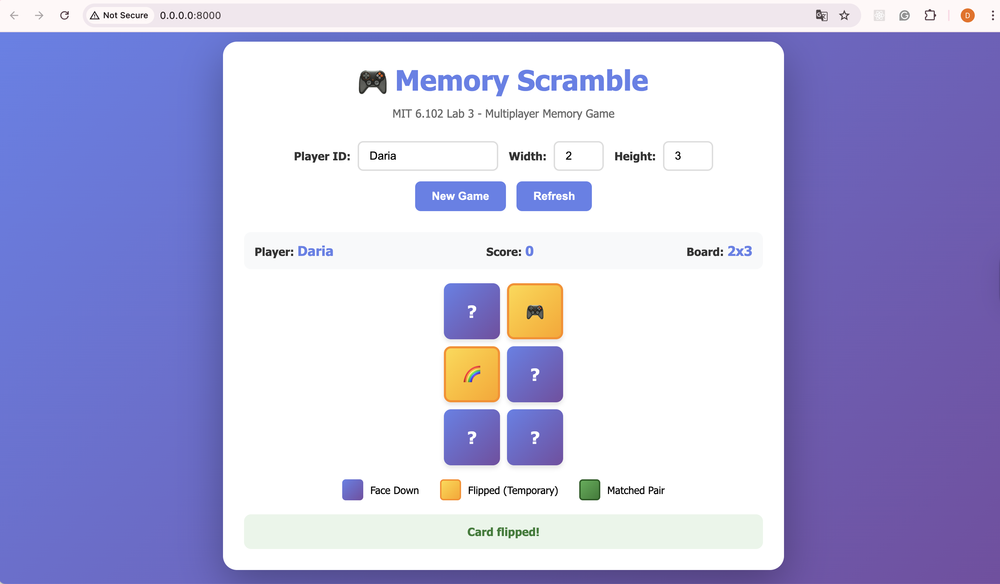
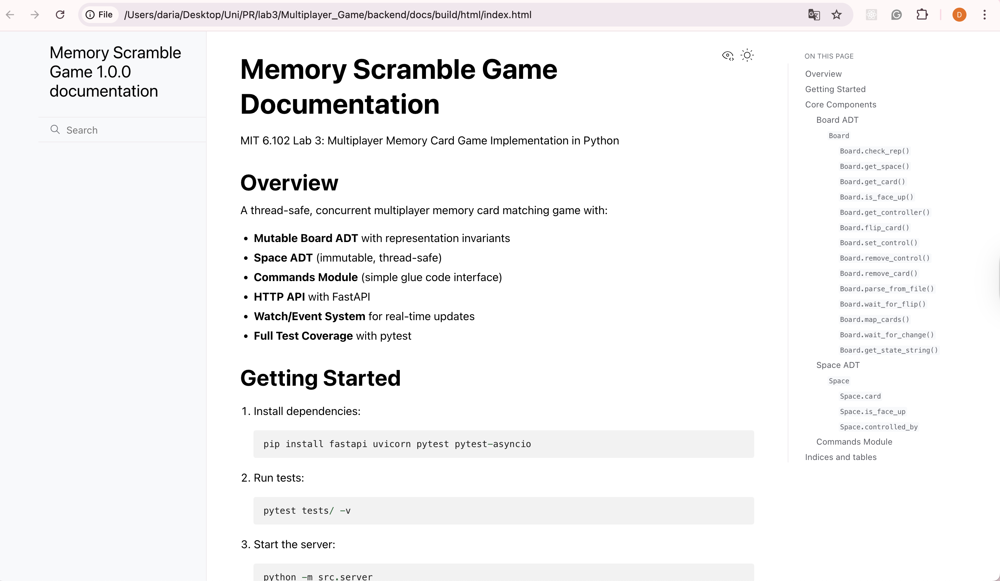

# Lab 3:Multiplayer Game

## 1. Game implementation
### Memory Scramble 4x4 Board Interface

The Memory Scramble game interface displaying a 4x4 board, player ID input, and controls to start or refresh the game.

### Memory Scramble Game Documentation Main Page

The main page with a 4x4 board with all cards hidden, showing the initial state of the game.

### Memory Scramble - Matched Pairs Displayed

The game board showing matched pairs highlighted in green, demonstrating successful pair matching and final state of the game.

### Memory Scramble 3x4 Board Initial State

The game interface showing a 3x4 board at the start of a new game, with all cards face down and ready for player interaction.

### Memory Scramble - Active Matching Attempt

The game interface showing a 2x3 board with two cards flipped temporarily in orange, highlighting the player's current attempt to find a matching pair.

## 2. Documentation

### Memory Scramble Game Documentation

The Sphinx-generated documentation for the Memory Scramble project, offering a detailed overview and instructions for getting started.
